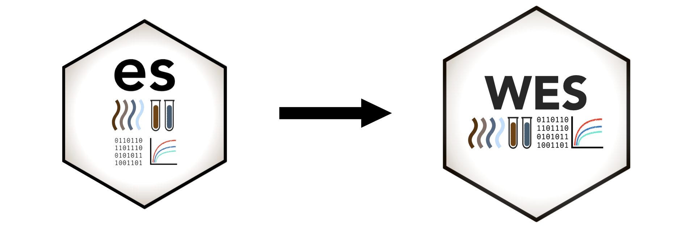

<!-- badges: start -->
[](https://lifecycle.r-lib.org/articles/stages.html#deprecated)
<!-- badges: end -->

<center>
## Thank you for visiting!

\
\

{width="70%"}

\
\

## The `es` R package has migrated to the `WES` R package. See details here:

\

# [www.r-wes.com](https://www.r-wes.com)

\
\

</center>

#### To uninstall the `es` package:
```r{}
install.packages("devtools", dependencies = TRUE)
devtools::uninstall(file.path(.libPaths()[1], 'es'))
```


