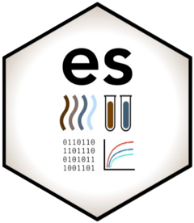

<!-- badges: start -->
[](https://github.com/gilesjohnr/es/actions/workflows/R-CMD-check.yaml)
<!-- badges: end -->

# **es**: an R package for analyzing environmental sampling data 

The `es` R package provides reproducible functions for collating and analyzing data from environmental sampling studies. Environmental Sampling (ES) of infectious diseases involves collecting samples from various sources (such as sewage, water, air, soil, or surfaces) to monitor the presence of pathogens in the environment. The tools here are intended to do the heavy lifting when analyzing ES data and include:

  * establishing standardized data formats,
  * relative and absolute quantification of qPCR data,
  * collating spatial data for sampling sites,
  * and analysis of sample sizes and temporal trends.

We developed the `es` R package primarily for epidemiological surveillance studies for multiple pathogens in Low- and Middle-Income Countries (LMIC) where samples are collected from informal sewer networks. However, the functions should generalize to other applications provided they use the same data formats. Feel free to reach out with comments or questions; the package is currently in development and maintained by John Giles ([@gilesjohnr](https://github.com/gilesjohnr)).

\

## Data standards

To use the data and methods provided in the `es` R package, input data must match the formatting shown in the `template_es_data` and `template_standard_curves` data objects. Both template data sets are described in more detail in the following vignette:

<center>[Templates for input data sets](https://gilesjohnr.github.io/es/articles/template_es_data.html)</center>

\

## Derivative qPCR quantities

Studies utilizing environmental sampling for disease surveillance often employ Quantitative Real-Time Polymerase Chain Reaction (qPCR) to detect pathogens in samples. In qPCR, the measurement is given as the cycle threshold (Ct) value which is often used with a cutoff value to render a presence/absence response. The Ct values can also be transformed into absolute or relative quantities of pathogen presence using the methods in the `calc_n_copies()`, `calc_delta_delta_ct()`, and `est_amplification_efficiency()` functions which are described in more detail in the following vignettes:

<center>[Absolute quantification of qPCR data](https://gilesjohnr.github.io/es/articles/derivative_quantities.html#absolute-quantification-calculating-the-number-of-target-gene-copies)</center>

<center>[Relative quantification of qPCR data](https://gilesjohnr.github.io/es/articles/derivative_quantities.html#relative-quantification-calculating-the-fold-change-in-gene-expression)</center>

<center>[qPCR Amplification efficiency](https://gilesjohnr.github.io/es/articles/amplification_efficiency.html)</center>

\

## Covariates

Environmental sampling studies conducted in informal sewer systems are vulnerable to confounding because the climate and local geography can impact the substrate available for collection. Therefore, we have included functions that download spatial data (such as climate, hydrology, and local populations) for the times and locations in the ES data. The following vignettes describe the data sources and methods used and relate these spatial data to ES data observations:

<center>[Sources of spatial data](https://gilesjohnr.github.io/es/articles/metadata_functions.html)</center>

<center>[Getting climate data](https://gilesjohnr.github.io/es/articles/get_climate_data.html)</center>

<center>[Calculating hydrological variables](https://gilesjohnr.github.io/es/articles/calc_hydro_variables.html)</center>

<center>[Calculating local population size](https://gilesjohnr.github.io/es/articles/calc_local_population.html)</center>

<center>[Getting administrative data](https://gilesjohnr.github.io/es/articles/get_admin_data.html)</center>
  
\
  
## Analysis

Additional analyses are under development and will likely include the calculation of cross-correlations among targets, time series models, and models of pathogen presence based on multiple gene targets. Currently, methods for quick tabulation of sampling statistics and overall detection rates are available in the `calc_sample_sizes()` function.

\

## Visualization

We are currently developing an RShiny application that will visualize the data and methods in the `es` package.

\

## Installation

Use the `devtools` package to install the development version of `es` from the GitHub repository. R version >= 3.5.0 recommended.
```r
install.packages("whitebox", dependencies=TRUE)
whitebox::install_whitebox()
whitebox::wbt_version()

install.packages('devtools')
devtools::install_github("gilesjohnr/es", dependencies=TRUE)
```

\

## Troubleshooting

For general questions, contact John Giles (john.giles@gatesfoundation.org) and/or Jillian Gauld (jillian.gauld@gatesfoundation.org). Note that this software is made available under a [Creative Commons 4.0](https://creativecommons.org/licenses/by/4.0/) license and was developed for specific environmental sampling applications and therefore may not generalize perfectly to all settings.

\

## Funding

This work was developed at the [Institute for Disease Modeling](https://www.idmod.org/) in support of funded research grants made by the [Bill \& Melinda Gates Foundation](https://www.gatesfoundation.org/).
