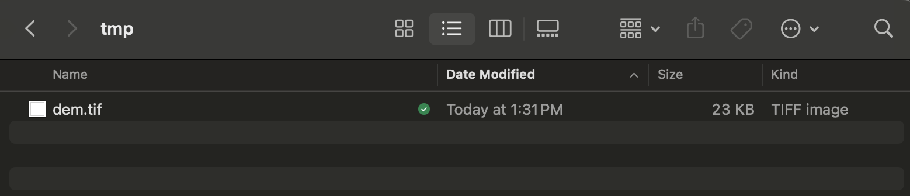
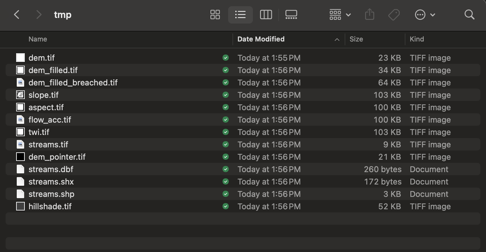
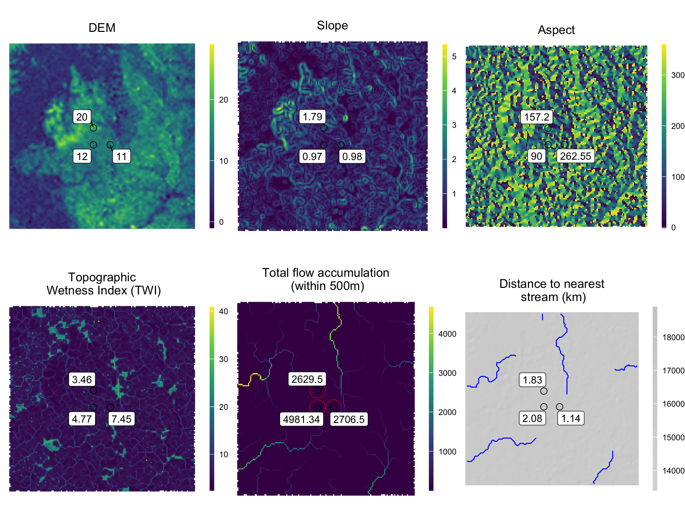

  
```{r setup, include = FALSE}
knitr::opts_chunk$set(
collapse = TRUE,
comment = "#>"
)
```

Environmental sampling for infectious diseases can take place in a wide range of conditions. Although some studies are able to sample waste water from relatively controled environments such as water treatment facilities in high-income settings, there are also studies that must collect samples from open sewers and streams in rural and/or low and middile income settings. In the latter scenario, there are numerous factors that affect waste water measurements and the question of how to best sample these open environments and control for confounding factors is an important topic of research. Therefore, we have included several functions in the `es` package that assist in characterizing local topography and hydrology which can help to evaluate differences among sites and assess the potential effects of site location.  

To characterize local topography and hydrology of sampling sites, we have included the `get_hydro_data()` function which takes a Digital Elevation Model (DEM) and calculates the following spatial variables for a given set of locations.

  * Elevation (in meters)
  * Slope
  * Aspect
  * Topographical Wetness Index (TWI)
  * Flow accumulation
  * Total flow accumulation within 500m
  * Distance to the nearest stream

See below for an example of how to use the `es` package to calculate these hydrological variables for a set of sampling sites.

### Download spatial data
``` {r, eval=FALSE}
library(es)
library(sp)
library(sf)
library(raster)
library(ggplot2)
library(ggrepel)
```

```{r, eval=FALSE}
# Get data frame of simulated environmental sampling data
df <- es::template_es_data
head(df)

date location_id  lat   lon target_name ct_value
1 2020-03-07           1 23.8 90.37    target_0       NA
2 2020-03-07           1 23.8 90.37    target_0       NA
3 2020-03-07           1 23.8 90.37    target_0       NA
4 2020-03-07           1 23.8 90.37    target_0 29.95670
5 2020-03-07           1 23.8 90.37    target_1 31.60111
6 2020-03-07           1 23.8 90.37    target_1 32.20208

# Create a directory to download spatial data and save intermediate output
dir.create(file.path(getwd(), 'tmp'))

# Download a DEM for the area surrounding sampling sites
download_elevation_data(lon = df$lon,
                        lat = df$lat,
                        path_output = file.path(getwd(), 'tmp'))
```

The Digital Elevation Model (DEM) is downloaded to the 'tmp' directory.

{width=70%}

### Calculate hydrological variables
``` {r, eval=FALSE}
# Calculate topographical and hydrological variables for each sampling site
hydro <- es::get_hydro_data(
     lon = template_es_data$lon,
     lat = template_es_data$lat,
     path_dem_raster = file.path(getwd(), 'tmp/dem.tif'),
     path_output = file.path(getwd(), 'tmp')
)

hydro

lon   lat elevation slope aspect  twi flow_acc flow_acc_500m km_to_nearest_stream
1 90.37 23.80        12  0.97  90.00 4.77     2.00       5014.22                 2.19
2 90.38 23.80        11  0.98 262.55 7.45    29.59       2706.60                 1.25
3 90.37 23.81        20  1.79 157.20 3.46     1.00       2684.25                 1.92

# Merge with environmental sampling data
result <- merge(df, hydro, by=c('lon', 'lat'), all.x=T)
head(result)

lon  lat       date location_id target_name ct_value elevation slope aspect  twi flow_acc flow_acc_500m km_to_nearest_stream
1 90.37 23.8 2020-03-07           1    target_0       NA        12  0.97     90 4.77        2       5014.22                 2.19
2 90.37 23.8 2020-03-07           1    target_0       NA        12  0.97     90 4.77        2       5014.22                 2.19
3 90.37 23.8 2020-03-07           1    target_0       NA        12  0.97     90 4.77        2       5014.22                 2.19
4 90.37 23.8 2020-03-07           1    target_0 29.95670        12  0.97     90 4.77        2       5014.22                 2.19
5 90.37 23.8 2020-03-07           1    target_1 31.60111        12  0.97     90 4.77        2       5014.22                 2.19
6 90.37 23.8 2020-03-07           1    target_1 32.20208        12  0.97     90 4.77        2       5014.22                 2.19

```

The intermediate spatial data produced in the calculation of topographical and hydrological variables are also saved to the 'tmp' output directory.

{width=70%}

### Plot results
These output data can be used for further analysis and visualization. Below is an example plot of the local population calculations shown above.

```{r, eval=FALSE}
out_path <- file.path(getwd(), 'tmp')
rast_dem <- raster::raster(file.path(out_path, 'dem.tif'))
rast_slp <- raster::raster(file.path(out_path, 'slope.tif'))
rast_asp <- raster::raster(file.path(out_path, 'aspect.tif'))
rast_twi <- raster::raster(file.path(out_path, 'twi.tif'))
rast_acc <- raster::raster(file.path(out_path, 'flow_acc.tif'))
rast_hill <- raster::raster(file.path(out_path, 'hillshade.tif'))
shp_streams <- sf::st_read(file.path(out_path, 'streams.shp'), quiet=TRUE)

pts <- sp::SpatialPoints(data.frame(x=hydro$lon, y=hydro$lat), proj4string=CRS("+proj=longlat +ellps=WGS84 +datum=WGS84 +no_defs"))
pts_buff_500 <- raster::buffer(pts, 500)


plot_base <-
     ggplot2::ggplot() +
     ggrepel::geom_label_repel(box.padding   = 0.5,
                               point.padding = 0.5,
                               segment.color = 'black',
                               segment.size = 0.25) +
     scale_fill_viridis_c(na.value='white') +
     coord_equal() +
     theme_void() +
     theme(plot.title = element_text(hjust = 0.5),
           legend.position='right',
           legend.title = element_blank(),
           legend.key.height=unit(40,'pt'),
           legend.key.width=unit(5,'pt'))


tmp <- as.data.frame(rast_dem, xy=TRUE)
colnames(tmp)[3] <- 'DEM'

plot_dem <-
     plot_base +
     geom_raster(data=tmp, aes(x=x, y=y, fill=DEM)) +
     geom_point(data=hydro, aes(x=lon, y=lat), pch=1, size=3) +
     ggrepel::geom_label_repel(data=hydro, aes(x=lon, y=lat, label=elevation)) +
     ggplot2::ggtitle('DEM')


tmp <- as.data.frame(rast_slp, xy=TRUE)
colnames(tmp)[3] <- 'slope'

plot_slope <-
     plot_base +
     geom_raster(data=tmp, aes(x=x, y=y, fill=slope)) +
     geom_point(data=hydro, aes(x=lon, y=lat), pch=1, size=3) +
     ggrepel::geom_label_repel(data=hydro, aes(x=lon, y=lat, label=slope)) +
     ggplot2::ggtitle('Slope')


tmp <- as.data.frame(rast_asp, xy=TRUE)
colnames(tmp)[3] <- 'aspect'

plot_aspect <-
     plot_base +
     geom_raster(data=tmp, aes(x=x, y=y, fill=aspect)) +
     geom_point(data=hydro, aes(x=lon, y=lat), pch=1, size=3) +
     ggrepel::geom_label_repel(data=hydro, aes(x=lon, y=lat, label=aspect)) +
     ggplot2::ggtitle('Aspect')


tmp <- raster::as.data.frame(rast_twi, xy=TRUE)
colnames(tmp)[3] <- 'twi'

plot_twi <-
     plot_base +
     geom_raster(data=tmp, aes(x=x, y=y, fill=twi)) +
     geom_point(data=hydro, aes(x=lon, y=lat), pch=1, size=3) +
     ggrepel::geom_label_repel(data=hydro, aes(x=lon, y=lat, label=twi)) +
     ggplot2::ggtitle('Topographic\n Wetness Index (TWI)')


tmp <- raster::as.data.frame(rast_acc, xy=TRUE)
colnames(tmp)[3] <- 'flow_acc_100m'

plot_acc_500m <-
     plot_base +
     geom_raster(data=tmp, aes(x=x, y=y, fill=flow_acc_100m)) +
     geom_point(data=hydro, aes(x=lon, y=lat), pch=1, size=3) +
     geom_sf(data=st_as_sf(pts_buff_500), colour = "red", fill = NA) +
     ggrepel::geom_label_repel(data=hydro, aes(x=lon, y=lat, label=flow_acc_500m)) +
     ggplot2::ggtitle('Total flow accumulation\n (within 500m)')


tmp <- raster::as.data.frame(rast_hill, xy=TRUE)
colnames(tmp)[3] <- 'hillshade'

plot_streams <-
     plot_base +
     geom_raster(data=tmp, aes(x=x, y=y, fill=hillshade)) +
     scale_fill_gradient2(low = "black", high = "grey80") +
     geom_sf(data=st_as_sf(shp_streams), colour = "blue", fill = 'blue') +
     geom_point(data=hydro, aes(x=lon, y=lat), pch=1, size=3) +
     ggrepel::geom_label_repel(data=hydro, aes(x=lon, y=lat, label=km_to_nearest_stream)) +
     ggplot2::ggtitle('Distance to nearest\n stream (km)')


gridExtra::grid.arrange(plot_dem, plot_slope, plot_aspect,
                        plot_twi, plot_acc_500m, plot_streams,
                        ncol=3)
```

{width=160%}
