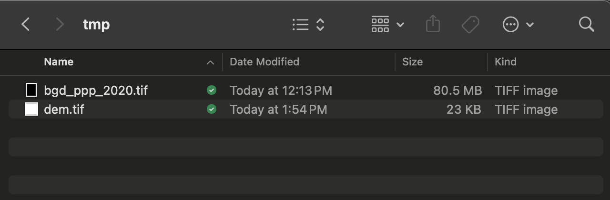
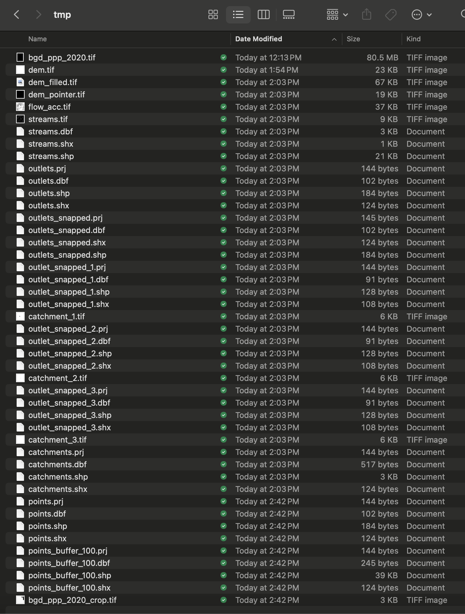
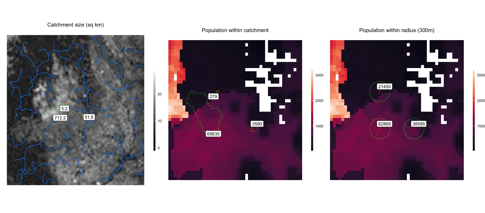

  
```{r setup, include = FALSE}
knitr::opts_chunk$set(
collapse = TRUE,
comment = "#>"
)
```

Determining the size of the local population that contributes to samples collected at a particular sampling site can be a challenge. When samples are taken from a sewer or stream network, it is reasonable to assume that the population residing within the drainage catchment is a close proxy for the actual contributing population. In settings where samples are collected from municipal sources, the contributing population may be harder to identify, especially sampling site is located in densely populated areas or travel hubs. 

To estimate the contributing population for a sampling site, we have included two methods: 

1) a catchment-based method that delineates the upstream drainage catchment for each sampling site and sums the population residing within it, and

2) a simple radius method that draws a user-defined radius around each sampling site and sums the population within it. 

These methods are a good starting point, however, future research will help to identify the best methods for estimating the local population contributing to sampling sites. We will add additional functionality to the package here based on future needs and research. 

See below for an example of how to use the `es` package to calculate the local population size for a set of sampling sites using the methods stated above.

\

### Download spatial data
``` {r, eval=FALSE}
library(es)
library(sp)
library(sf)
library(raster)
library(ggplot2)
library(ggrepel)
```

``` {r, eval=FALSE}
# Get data frame of simulated environmental sampling data
df <- es::template_es_data
head(df)

date location_id  lat   lon target_name ct_value
1 2020-03-07           1 23.8 90.37    target_0       NA
2 2020-03-07           1 23.8 90.37    target_0       NA
3 2020-03-07           1 23.8 90.37    target_0       NA
4 2020-03-07           1 23.8 90.37    target_0 29.95670
5 2020-03-07           1 23.8 90.37    target_1 31.60111
6 2020-03-07           1 23.8 90.37    target_1 32.20208

# Create a directory to download spatial data and save intermediate output
dir.create(file.path(getwd(), 'tmp'))

# Download population raster data from Worldpop
es::download_worldpop_data(
     iso3 = 'BGD',
     year = 2020,
     constrained = FALSE,
     UN_adjusted = FALSE,
     path_output = file.path(getwd(), 'tmp')
)

# Download a DEM for the area surrounding sampling sites
es::download_elevation_data(
     lon = df$lon,
     lat = df$lat,
     path_output = file.path(getwd(), 'tmp')
)
```

Population and Digital Elevation Model (DEM) are downloaded to the 'tmp' directory.

{width=70%}

\

### Calculate local population
``` {r, eval=FALSE}
# Delineate drainage catchments and calculate the population size within them
pop_catchment <- es::get_population_catchment(
     lon = df$lon,
     lat = df$lat,
     path_pop_raster = file.path(getwd(), 'tmp/bgd_ppp_2020.tif'),
     path_dem_raster = file.path(getwd(), 'tmp/dem.tif'),
     path_output = file.path(getwd(), 'tmp')
)

pop_catchment

lon   lat catchment_area_km2 population_catchment
1 90.37 23.80              712.2                69635
2 90.38 23.80               31.0                 2834
3 90.37 23.81                5.2                  279

pop_radius <- es::get_population_radius(
     lon = df$lon,
     lat = df$lat,
     radius = 300,
     path_pop_raster = file.path(getwd(), 'tmp/bgd_ppp_2020.tif'),
     path_output = file.path(getwd(), 'tmp')
)

pop_radius

    lon   lat population_radius_300
1 90.37 23.80                 62868
2 90.38 23.80                 38588
3 90.37 23.81                 21450

# Merge with environmental sampling data
result <- merge(df, pop_catchment, by=c('lon', 'lat'), all.x=T)
result <- merge(result, pop_radius, by=c('lon', 'lat'), all.x=T)
head(result)

    lon  lat       date location_id target_name ct_value catchment_area_km2 population_catchment population_radius_300
1 90.37 23.8 2020-03-07           1    target_0       NA              712.2                69635                 62868
2 90.37 23.8 2020-03-07           1    target_0       NA              712.2                69635                 62868
3 90.37 23.8 2020-03-07           1    target_0       NA              712.2                69635                 62868
4 90.37 23.8 2020-03-07           1    target_0 29.95670              712.2                69635                 62868
5 90.37 23.8 2020-03-07           1    target_1 31.60111              712.2                69635                 62868
6 90.37 23.8 2020-03-07           1    target_1 32.20208              712.2                69635                 62868

```

The intermediate spatial data produced in the delineation of drainage catchments and calculation of population size are also saved to the 'tmp' output directory.

{width=70%}

\

### Plot results
These output data can be used for further analysis and visualization. Below is an example plot of the local population calculations shown above.

```r{eval=FALSE}
pts <- sp::SpatialPoints(data.frame(x=pop_catchment$lon, y=pop_catchment$lat), proj4string=sp::CRS("+proj=longlat +ellps=WGS84 +datum=WGS84 +no_defs"))

rast_dem <- raster::raster(file.path(getwd(), 'tmp/dem.tif'))
rast_pop <- raster::raster(file.path(getwd(), 'tmp/bgd_ppp_2020_crop.tif'))

shp_streams <- sf::st_read(file.path(getwd(), 'tmp/streams.shp'), quiet=TRUE, crs = "+proj=longlat +ellps=WGS84 +datum=WGS84 +no_defs")
shp_catchments <- sf::st_read(file.path(getwd(), 'tmp/catchments.shp'), quiet=TRUE)
shp_radius <- sf::st_read(file.path(getwd(), 'tmp/points_buffer_300.shp'), quiet=TRUE)


tmp <- raster::as.data.frame(rast_dem, xy=TRUE)
colnames(tmp)[3] <- 'dem'

plot_catchment <-
     ggplot2::ggplot() +
     geom_raster(data=tmp, aes(x=x, y=y, fill=dem)) +
     geom_sf(data=sf::st_as_sf(shp_streams), colour = "dodgerblue", fill = NA) +
     geom_sf(data=sf::st_as_sf(shp_catchments), colour = "green", fill = NA) +
     geom_point(data=pop_catchment, aes(x=lon, y=lat), pch=3, size=2, color='red') +
     ggrepel::geom_label_repel(data=pop_catchment, aes(x=lon, y=lat, label=catchment_area_km2)) +
     ggplot2::ggtitle('Catchment size (sq km)') +
     ggrepel::geom_label_repel(box.padding   = 0.5,
                               point.padding = 0.5,
                               segment.color = 'black',
                               segment.size = 0.25) +
     scale_fill_gradient(low="black", high="white") +
     coord_sf() +
     theme_void() +
     theme(plot.title = element_text(hjust = 0.5),
           legend.position='right',
           legend.title = element_blank(),
           legend.key.height=unit(40,'pt'),
           legend.key.width=unit(5,'pt'))


tmp <- raster::as.data.frame(rast_pop, xy=TRUE)
colnames(tmp)[3] <- 'pop'

plot_catchment_pop <-
     ggplot2::ggplot() +
     geom_raster(data=tmp, aes(x=x, y=y, fill=pop)) +
     geom_sf(data=sf::st_as_sf(shp_catchments), colour = "green", fill = NA) +
     geom_point(data=pop_catchment, aes(x=lon, y=lat), pch=3, size=2, color='red') +
     ggrepel::geom_label_repel(data=pop_catchment, aes(x=lon, y=lat, label=population_catchment)) +
     ggplot2::ggtitle('Population within catchment') +
     ggrepel::geom_label_repel(box.padding   = 0.5,
                               point.padding = 0.5,
                               segment.color = 'black',
                               segment.size = 0.25) +
     scale_fill_viridis_c(na.value='white', option='rocket') +
     coord_sf() +
     theme_void() +
     theme(plot.title = element_text(hjust = 0.5),
           legend.position='right',
           legend.title = element_blank(),
           legend.key.height=unit(40,'pt'),
           legend.key.width=unit(5,'pt'))


tmp <- raster::as.data.frame(rast_pop, xy=TRUE)
colnames(tmp)[3] <- 'pop'

plot_radius_pop <-
     ggplot2::ggplot() +
     geom_raster(data=tmp, aes(x=x, y=y, fill=pop)) +
     geom_sf(data=sf::st_as_sf(shp_radius), colour = "green", fill = NA) +
     geom_point(data=pop_catchment, aes(x=lon, y=lat), pch=3, size=2, color='red') +
     ggrepel::geom_label_repel(data=pop_radius, aes(x=lon, y=lat, label=population_radius_300)) +
     ggplot2::ggtitle('Population within radius (300m)') +
     ggrepel::geom_label_repel(box.padding   = 0.5,
                               point.padding = 0.5,
                               segment.color = 'black',
                               segment.size = 0.25) +
     scale_fill_viridis_c(na.value='white', option='rocket') +
     coord_sf() +
     theme_void() +
     theme(plot.title = element_text(hjust = 0.5),
           legend.position='right',
           legend.title = element_blank(),
           legend.key.height=unit(40,'pt'),
           legend.key.width=unit(5,'pt'))


gridExtra::grid.arrange(plot_catchment, plot_catchment_pop, plot_radius_pop, ncol=3)
```

{width=160%}
