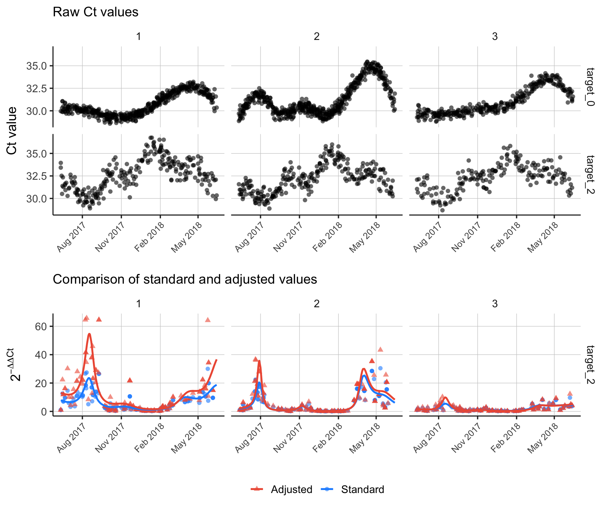

```{r setup, include = FALSE}
knitr::opts_chunk$set(
collapse = TRUE,
comment = "#>"
)
```

Studies utilizing environmental sampling for disease surveillance often employ Quantitative Real-Time Polymerase Chain Reaction (qPCR) to detect pathogens in samples. In qPCR, the measurement is given as the cycle threshold (Ct) value, which is the number of PCR cycles required for the fluorescent signal to exceed a predefined threshold, indicating the presence of the pathogen's target nucleic acid (see [Thermo Fisher's qPCR basics](https://www.thermofisher.com/us/en/home/life-science/pcr/real-time-pcr/real-time-pcr-learning-center/real-time-pcr-basics.html)). The Ct value is often used to determine the presence or absence of a pathogen in a sample, where the pathogen is deemed absent if amplification reaches 40 cycles with no fluorescent signal [@caraguel2011]. Although qPCR can be a powerful method for pathogen detection, the Ct value can also estimate the overall *quantity* of pathogen genetic material in a sample. However, the starting amount of target nucleic acid in a sample can be influenced by many external factors [@rabaan2021; @bustin2005] which makes the normalization of these data a challenge. To help address these challenges, we have included both an absolute and a relative quantification method in the `es` package with the following functions:

1.  `calc_n_copies()` which calculates the number of gene target copies using standard curve quantification described by @pfaffl2012, and

2.  `calc_delta_delta_ct()` which calculates the relative fold-change in gene target quantity compared to a reference gene target described by @livak2001.

3. `est_amplification_efficiency()` is a method for estimating the percentile amplification efficiency of the qPCR using a standard curve assay (see @yuan2008).

Our hope is that transforming the Ct value into these derivative quantities can help make environmental sampling data more interpretable and to normalize its variance in a manner that is less vulnerable to confounding. The examples below show how to calculate these quantities given that your data match the template data shown in the `template_es_data` and `template_standard_curve` objects.

\

## Absolute quantification: calculating the number of target gene copies

Calculating the number of target gene copies in a sample is a form of absolute quantification. While it is still susceptible to external confounders that influence the starting amount of nucleic acid and any inhibitors to amplification that might be present [@bustin2005], this a count variable that is more interpretable than raw Ct values and allows for normalization with additional covariates. To calculate the number of target gene copies, a standard curve assay is required which relates known concentrations of each gene target to their expected Ct values for the specific target, PCR machine, and reagents used [@pfaffl2012].

Assuming the PCR machine's amplification efficiency is 100%, the number of gene copies is expected to double with each cycle [@ruijter2009] resulting in a logarithmic relationship between Ct values and gene copies, where the number of target gene copies decreases exponentially as the number of PCR cycles increases linearly.

<center>{width="95%"}</center>

Due the logarithmic relationship of PCR kinetics we use a log-linear model to relate known gene target quantities from the standard curve to the Ct values observed in the qPCR performed on our study samples:

$$
\log(\text{number gene copies}_i) \sim \alpha + \beta_i \cdot \text{Ct value}_i + \epsilon.
$$

<center>{width="65%"}</center>

The code below shows how to how to use the `calc_n_copies()` function on the `template_es_data` and `template_standard_curve` objects to calculate the number of target gene copies.

```{r, eval=FALSE}
df <- es::template_es_data
head(df)

date location_id  lat   lon target_name ct_value
1 2020-03-07           1 23.8 90.37    target_0       NA
2 2020-03-07           1 23.8 90.37    target_0       NA
3 2020-03-07           1 23.8 90.37    target_0       NA
4 2020-03-07           1 23.8 90.37    target_0 29.95670
5 2020-03-07           1 23.8 90.37    target_1 31.60111
6 2020-03-07           1 23.8 90.37    target_1 32.20208

sc <- es::template_standard_curve
head(sc)

target_name n_copies ct_value
1    target_0    1e+01 31.54740
2    target_0    1e+02 26.95023
3    target_0    1e+03 22.39630
4    target_0    1e+04 21.47894
5    target_0    1e+05 16.04474
6    target_1    1e+01 31.85645

result <- es::calc_n_copies(ct_values = df$ct_value,
                            target_names = df$target_name,
                            standard_curves = sc)

df$n_copies <- result
head(df)

date location_id  lat   lon target_name ct_value n_copies
1 2020-03-07           1 23.8 90.37    target_0       NA       NA
2 2020-03-07           1 23.8 90.37    target_0       NA       NA
3 2020-03-07           1 23.8 90.37    target_0       NA       NA
4 2020-03-07           1 23.8 90.37    target_0 29.95670 21.59581
5 2020-03-07           1 23.8 90.37    target_1 31.60111 32.99040
6 2020-03-07           1 23.8 90.37    target_1 32.20208 21.93164
```

Note the prediction for the number of target gene copies shown below is convenient in that it is more interpretable that the Ct value method, however it is an absolute quantification method that may need further normalization to adjust for environmental confounders. An alternative is to use a relative quantitification method such as $\Delta \Delta \text{Ct}$ described in the following section.

<center>{width="70%"}</center>

\

## Relative quantification: calculating the fold-change in gene expression

While absolute quantification of the number of target gene copies is nicely interpretable, it does not explicitly account for the starting amount of nucleic acid in the sample or the amplification efficiency of the PCR assay [@bustin2005]. Normalization of qPCR data has been a general methodological challenge in biology and has motivated much work on statistical methods to transform qPCR data [@mar2009; @bolstad2003]. One method of normalization is the $\Delta \Delta \text{Ct}$ method of calculating the fold-change in gene expression of the target relative to one or more reference targets [@livak2001]. The $\Delta \Delta \text{Ct}$ method is perhaps the most robust way to normalize qPCR data and is particularly important for environmental sampling data due to the often uncontrolled sources of samples.

Here we have developed functions that allow for the calculation of the standard $\Delta \Delta \text{Ct}$ described by @livak2001 and the adjusted $\Delta \Delta \text{Ct}$, which is adjusted for the PCR amplification efficiency, described by @yuan2008. We have also included functionality to estimate the percentile amplification efficiency for a target nucleic acid using a standard curve assay following the methods in [@yuan2008; @yuan2006].

Our formulation of $\Delta \Delta \text{Ct}$ begins with the standard method which can be defined as:

$$
\begin{align}
\text{Standard method} & = 2^{-\Delta \Delta \text{Ct}} \\ 
-\Delta \Delta \text{Ct} & = -(\Delta \text{Ct}_{\text{treatment}} - \Delta \text{Ct}_{\text{control}})\\
\Delta \text{Ct}_{\text{treatment}} & = \text{Ct}_{\text{target,treatment}} - \text{Ct}_{\text{reference,treatment}}\\
\Delta \text{Ct}_{\text{control}} & = \text{Ct}_{\text{target,control}} - \text{Ct}_{\text{reference,control}}\\
\tag{1}
\end{align}
$$ 

A major assumption of the standard method is that the amplification efficiency of the qPCR assay is 100% efficient. In practice, the efficiency of an assay is likely to be slightly less than 1, where a only a proportion of sample nucleic acids are replicated in each cycle [@stolovitzky1996], which can have a non-trivial impact on an output variable with an exponential component. Therefore, the adjusted $\Delta \Delta \text{Ct}$ method accounts for an imperfect efficiency amplification efficiency (noted as $\phi$ here). 

$$
\begin{align}
\text{Adjusted method} & = 2^{-\Delta \Delta \text{Ct}} \\ 
-\Delta \Delta \text{Ct} & = -(\Delta \text{Ct}_{\text{treatment}} - \Delta \text{Ct}_{\text{control}})\\
\Delta \text{Ct}_{\text{treatment}} & = \text{Ct}_{\text{target,treatment}} \times \phi_{\text{target,treatment}} - \text{Ct}_{\text{reference,treatment}} \times \phi_{\text{reference,treatment}}\\
\Delta \text{Ct}_{\text{control}} & = \text{Ct}_{\text{target,control}} \times \phi_{\text{target,control}} - \text{Ct}_{\text{reference,control}} \times \phi_{\text{reference,control}}\\
\tag{2}
\end{align}
$$

Since environmental sampling data typically do not have a control group, we use the temporal method in the `es` package to relate all "treatment" observations at time $t$ to the "control" observations at time $t=0$; see Section 1.4 of @livak2001. Which means we can write Equation 1 above as: 

$$
\begin{align}
\text{Standard time-based method} & = 2^{-\Delta \Delta \text{Ct}} \\ 
-\Delta \Delta \text{Ct} & = -(\Delta \text{Ct}_{t} - \Delta \text{Ct}_{t=0})\\
\Delta \text{Ct}_{t} & = \text{Ct}_{\text{target},t} - \text{Ct}_{\text{reference},t}\\
\Delta \text{Ct}_{t=0} & = \text{Ct}_{\text{target},t=0} - \text{Ct}_{\text{reference},t=0}\\
\tag{3}
\end{align}
$$ 

Further, when we incorporate weighting according to the amplification efficiency of each target as described in @yuan2008 and @yuan2006, we get the following: 

$$
\begin{align}
\text{Adjusted time-based method} & = 2^{-\Delta \Delta \text{Ct}} \\ 
-\Delta \Delta \text{Ct} & = -(\Delta \text{Ct}_{t} - \Delta \text{Ct}_{t=0})\\
\Delta \text{Ct}_{t} & = \text{Ct}_{\text{target},t} \times \phi_{\text{target}} - \text{Ct}_{\text{reference},t} \times \phi_{\text{reference}}\\
\Delta \text{Ct}_{t=0} & = \text{Ct}_{\text{target},t=0} \times \phi_{\text{target}} - \text{Ct}_{\text{reference},t=0} \times \phi_{\text{reference}}\\
\tag{4}
\end{align}
$$ 

where, $\phi_{\text{target}}$ and $\phi_{\text{reference}}$ are the estimated qPCR amplification efficiency values for the target and reference genes respectively. Note that traditionally there would also be a $\phi$ value for the treatment and control groups, but since environmental sampling data do not have an explicit sample treatment we use the same $\phi$ for when time = $t$ and $t=0$.

The following code blocks show how to calculate both the standard and adjusted $\Delta \Delta \text{Ct}$ values for a simulated environmental sampling data set shown in the `template_es_data` and `template_standard_curve` data objects. To calculate the standard $\Delta \Delta \text{Ct}$ value (Equation 1) initially described in @livak2001 we assume a PCR efficiency of 1 for all targets. The following code does the calculation for a single observation.

```{r, eval=FALSE}
# Standard method
calc_delta_delta_ct(ct_target_treatment = 32.5,
                    ct_reference_treatment = 25,
                    ct_target_control = 34,
                    ct_reference_control = 30)

[1] 0.08838835
```

And adjusted $\Delta \Delta \text{Ct}$ (Equation 2) can be calculated by incorporating the arguments with prefix `pae_*` for percentile amplification efficiency.
```{r,eval=FALSE}
# Adjusted method incorporating amplification efficiency
calc_delta_delta_ct(ct_target_treatment = 32.5,
                    ct_reference_treatment = 25,
                    ct_target_control = 34,
                    ct_reference_control = 30,
                    pae_target_treatment=0.97,
                    pae_target_control=0.98,
                    pae_reference_treatment=0.98,
                    pae_reference_control=0.99)

[1] 0.09440454
```

The temporally-controlled standard $\Delta \Delta \text{Ct}$ calculation (Equation 3) can be applied to the entire data set using the `apply_delta_delta_ct()` function.

```{r, eval=FALSE}
# Standard temporally-controlled method
df_example <- template_es_data
colnames(df_example)[colnames(df_example) == 'date'] <- 'sample_date'

ddct_standard <- apply_delta_delta_ct(df = df_example,
                                      target_names = c('target_1', 'target_2', 'target_3'),
                                      reference_names = rep('target_0', 3))

head(ddct_standard)

  location_id sample_date target_name delta_delta_ct
1           1  2020-03-07    target_1       1.000000
2           1  2020-03-11    target_1      17.762262
3           1  2020-03-23    target_1      29.642154
4           1  2020-03-24    target_1      32.191141
5           1  2020-03-30    target_1       5.694505
6           1  2020-04-03    target_1       8.620370
```

And the adjusted time-based $\Delta \Delta \text{Ct}$ calculation (Equation 4) can be calculated after using the `apply_amplification_efficiency()` function to get efficiency estimates from a standard curve data set. 

```{r, eval=FALSE}
# Adjusted temporally-controlled method
df_example <- template_es_data
colnames(df_example)[colnames(df_example) == 'date'] <- 'sample_date'

pae <- apply_amplification_efficiency(template_standard_curve)

ddct_adjusted <- apply_delta_delta_ct(df = df_example,
                                      target_names = c('target_1', 'target_2', 'target_3'),
                                      reference_names = rep('target_0', 3),
                                      pae_names = pae$target_name,
                                      pae_values = pae$mean)

head(ddct_adjusted)

  location_id sample_date target_name delta_delta_ct
1           1  2020-03-07    target_1       1.000000
2           1  2020-03-11    target_1      17.465229
3           1  2020-03-23    target_1      26.118476
4           1  2020-03-24    target_1      29.213109
5           1  2020-03-30    target_1       5.485189
6           1  2020-04-03    target_1       7.632729
```

Finally, the code below shows a full example of adding adjusted time-based $\Delta \Delta \text{Ct}$ to a data frame and visualizing the result.

```{r, eval=FALSE}
library(mgcv)
library(ggplot2)
library(cowplot)

# Estimate amplification efficiency
pae <- apply_amplification_efficiency(template_es_data)

# Calculate standard delta delta Ct
ddct_standard <- apply_delta_delta_ct(df = df_example,
                                      target_names = c('target_1', 'target_2', 'target_3'),
                                      reference_names = rep('target_0', 3))

# Calculate adjusted delta delta Ct
ddct_adjusted <- apply_delta_delta_ct(df = df_example,
                                      target_names = c('target_1', 'target_2', 'target_3'),
                                      reference_names = rep('target_0', 3),
                                      pae_names = pae$target_name,
                                      pae_values = pae$mean)

# Combine results
colnames(ddct_standard)[colnames(ddct_standard) == 'delta_delta_ct'] <- 'delta_delta_ct_standard'
colnames(ddct_adjusted)[colnames(ddct_adjusted) == 'delta_delta_ct'] <- 'delta_delta_ct_adjusted'
ddct <- merge(ddct_standard, ddct_adjusted, by=c('location_id', 'sample_date', 'target_name'), all=T)
ddct <- merge(template_es_data, ddct, by=c('location_id', 'sample_date', 'target_name'), all.x=T)

# Fit time series models to delta delta Ct to visualize time trends
fit_gam <- function(x) {

     require(mgcv)

     # Fit GAMs with a Gaussian process smoothing term and a Gamma link function
     mod_standard <- gam(delta_delta_ct_standard ~ s(as.numeric(sample_date), bs = "gp"), family = Gamma(link = "inverse"), data = x, method = "REML", na.action = na.exclude)
     mod_adjusted <- gam(delta_delta_ct_adjusted ~ s(as.numeric(sample_date), bs = "gp"), family = Gamma(link = "inverse"), data = x, method = "REML", na.action = na.exclude)

     # Add model predictions to data
     x$pred_delta_delta_ct_standard <- predict(mod_standard, newdata = x, type='response', se.fit=F)
     x$pred_delta_delta_ct_adjusted <- predict(mod_adjusted, newdata = x, type='response', se.fit=F)

     return(x)

}

# Apply GAMs by location
tmp <- ddct[ddct$target_name %in% c('target_2'),]
tmp <- lapply(split(tmp, factor(tmp$location_id)), fit_gam)
tmp <- do.call(rbind, tmp)

# Visualize result
p1 <- ggplot(ddct[ddct$target_name %in% c('target_0', 'target_2'),],
       aes(x = sample_date)) +
     geom_point(aes(y = ct_value), alpha = 0.6, shape = 16, size = 2) +
     facet_grid(rows = vars(target_name), cols = vars(location_id)) +
     theme_bw(base_size = 15) +
     theme(panel.grid.major = element_line(size = 0.25, linetype = 'solid', color = 'grey80'),
           panel.grid.minor = element_blank(),
           panel.border = element_blank(),
           axis.line = element_line(size = 0.5, linetype = 'solid', color = 'black'),
           legend.position = "bottom",
           legend.title = element_blank(),
           strip.background = element_rect(fill = "white", color = "white", size = 0.5),
           axis.text.x = element_text(angle = 45, hjust = 1, size = 10)) +
     labs(x = element_blank(),
          y = "Ct value",
          subtitle = "Raw Ct values") +
     scale_x_date(date_breaks = "3 month", date_labels = "%b %Y")


p2 <- ggplot(tmp, aes(x = sample_date)) +
     geom_point(aes(y = delta_delta_ct_standard, color = 'Standard'), alpha = 0.6, shape = 16, size = 2) +
     geom_point(aes(y = delta_delta_ct_adjusted, color = 'Adjusted'), alpha = 0.6, shape = 17, size = 2) +
     geom_line(aes(y = pred_delta_delta_ct_standard, color = 'Standard'), size = 1) +
     geom_line(aes(y = pred_delta_delta_ct_adjusted, color = 'Adjusted'), size = 1) +
     facet_grid(rows = vars(target_name), cols = vars(location_id)) +
     theme_bw(base_size = 15) +
     theme(panel.grid.major = element_line(size = 0.25, linetype = 'solid', color = 'grey80'),
          panel.grid.minor = element_blank(),
          panel.border = element_blank(),
          axis.line = element_line(size = 0.5, linetype = 'solid', color = 'black'),
          legend.position = "bottom",
          legend.title = element_blank(),
          strip.background = element_rect(fill = "white", color = "white", size = 0.5),
          axis.text.x = element_text(angle = 45, hjust = 1, size = 10)) +
     labs(x = element_blank(),
          y = expression(2^{-Delta * Delta * Ct}),
          subtitle = "Comparison of standard and adjusted values") +
     scale_color_manual(values = c("Standard" = "dodgerblue", "Adjusted" = "tomato2")) +
     scale_x_date(date_breaks = "3 month", date_labels = "%b %Y")

plot_grid(p1, p2, nrow=2, align='v', rel_heights = c(1.1,1))

```

<center>{width="100%"}</center>

\

## References
