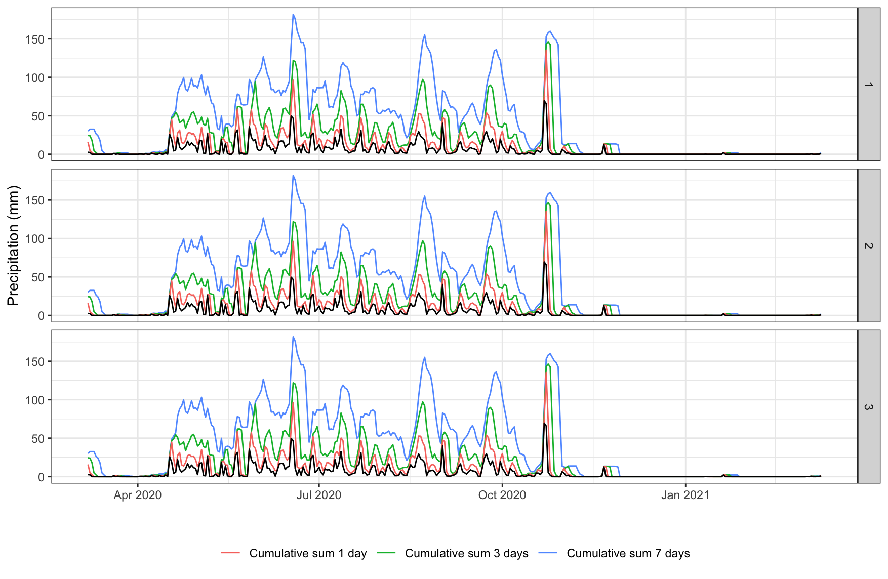
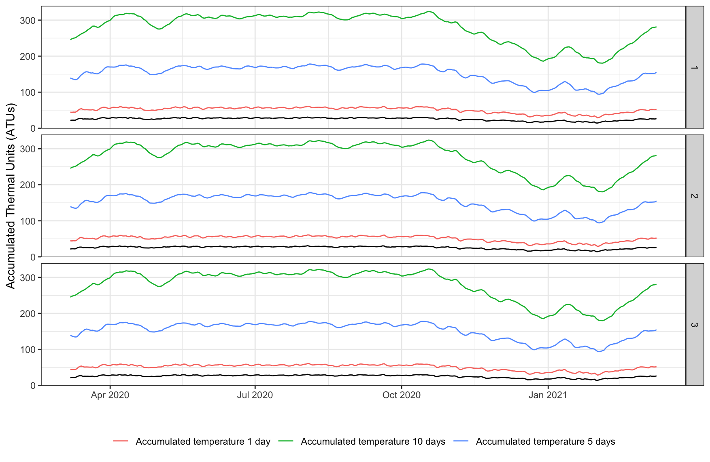
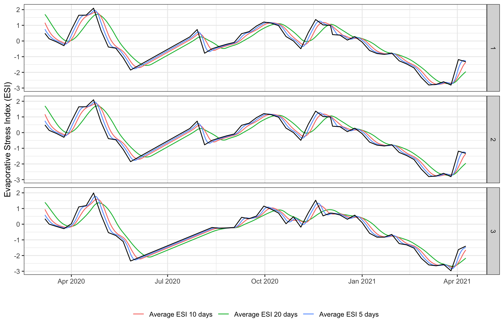
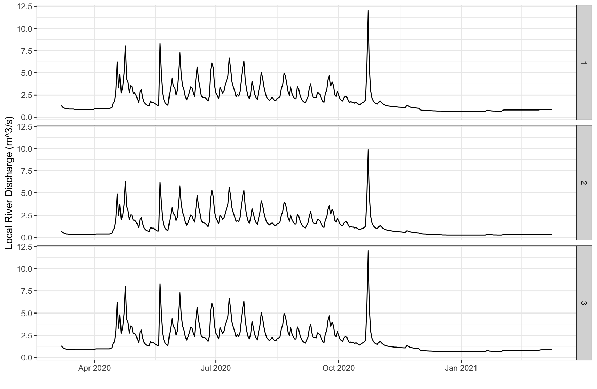
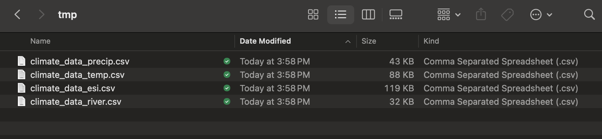

  
```{r setup, include = FALSE}
knitr::opts_chunk$set(
collapse = TRUE,
comment = "#>"
)
```

The amount of rainfall directly influences the volume of waste water available for environmental sampling depending on the time and location of a particular sample. The overall temperature of a site may also impact assays depending on the pathogen in question. The extent to which climatic factors act as confounders for environmental sampling efforts is still under exploration which is why we have included reproducible functions for retrieving climate data for sampling sites. 

The provided wrapper functions access open-source data APIs and relate several climate variables to the locations and times of sample observations. These climate variables include:

  * Cumulative sum of precipitation in millimeters (mm) for the previous X number of days
  * Accumulated Thermal Units (ATUs) for the previous X number of days
  * Evaporative Stress Index (ESI)
  * Daily river discharge data from the nearest river ($m^3/s$)
  
See below for an example of how to use the `es` package to calculate these climatic variables for the locations and times of a set of sampling observations.

### Setup with environmental sampling observations
```{r, eval=FALSE}
library(es)
library(ggplot2)

# Get data frame of simulated environmental sampling data
df <- es::template_es_data
head(df)

date location_id  lat   lon target_name ct_value
1 2020-03-07           1 23.8 90.37    target_0       NA
2 2020-03-07           1 23.8 90.37    target_0       NA
3 2020-03-07           1 23.8 90.37    target_0       NA
4 2020-03-07           1 23.8 90.37    target_0 29.95670
5 2020-03-07           1 23.8 90.37    target_1 31.60111
6 2020-03-07           1 23.8 90.37    target_1 32.20208
```

### Precipitation data
```{r, eval=FALSE}
# Get precipitation data
precip <- es::get_precip_data(lon = df$lon,
                              lat = df$lat,
                              dates = df$date,
                              intervals = c(1,3,7))

head(precip)

   id  lat   lon       date precip_daily_sum precip_daily_sum_1 precip_daily_sum_3 precip_daily_sum_7
8   1 23.8 90.37 2020-03-07              2.6               15.8               24.4               30.2
9   1 23.8 90.37 2020-03-08              2.3                4.9               24.0               32.5
10  1 23.8 90.37 2020-03-09              0.0                2.3               18.1               32.5
11  1 23.8 90.37 2020-03-10              0.0                0.0                4.9               32.5
12  1 23.8 90.37 2020-03-11              0.0                0.0                2.3               26.7
13  1 23.8 90.37 2020-03-12              0.0                0.0                0.0               24.0

ggplot2::ggplot(precip, aes(x = date)) +
     geom_line(aes(y = precip_daily_sum_7, col='Cumulative sum 7 days')) +
     geom_line(aes(y = precip_daily_sum_3, col='Cumulative sum 3 days')) +
     geom_line(aes(y = precip_daily_sum_1, col='Cumulative sum 1 day')) +
     geom_line(aes(y = precip_daily_sum)) +
     facet_grid(rows=vars(id)) +
     labs(x="", y = "Precipitation (mm)") +
     theme_bw() +
     theme(legend.position = 'bottom',
           legend.title = element_blank())
```

{width=100%}

### Temperature data
```{r, eval=FALSE}
# Get temperature data
temp <- es::get_temp_data(lon = df$lon,
                          lat = df$lat,
                          dates = df$date,
                          intervals = c(1,5,10))

head(temp)

   id  lat   lon       date temp_daily_atu temp_daily_atu_1 temp_daily_atu_5 temp_daily_atu_10
11  1 23.8 90.37 2020-03-07       21.74167         44.39167         139.3792          245.8292
12  1 23.8 90.37 2020-03-08       22.37917         44.12083         137.4625          248.1125
13  1 23.8 90.37 2020-03-09       22.32917         44.70833         135.8833          249.9000
14  1 23.8 90.37 2020-03-10       22.08750         44.41667         134.8625          250.8208
15  1 23.8 90.37 2020-03-11       24.07917         46.16667         135.2667          253.2375
16  1 23.8 90.37 2020-03-12       26.17917         50.25833         138.7958          256.4333

ggplot2::ggplot(temp, aes(x = date)) +
     geom_line(aes(y = temp_daily_atu_10, col='Accumulated temperature 10 days')) +
     geom_line(aes(y = temp_daily_atu_5, col='Accumulated temperature 5 days')) +
     geom_line(aes(y = temp_daily_atu_1, col='Accumulated temperature 1 day')) +
     geom_line(aes(y = temp_daily_atu)) +
     facet_grid(rows=vars(id)) +
     labs(x="", y = "Accumulated Thermal Units (ATUs)") +
     theme_bw() +
     theme(legend.position = 'bottom',
           legend.title = element_blank())
```

{width=100%}

### Evaporative Stress Index (ESI) data
```{r, eval=FALSE}
# Evaporative Stress Index (ESI) data
esi <- es::get_esi_data(lon = df$lon,
                        lat = df$lat,
                        dates = df$date,
                        intervals = c(5,10,20))
head(esi)

  id       date   lon  lat esi_daily_avg observed esi_daily_avg_5 esi_daily_avg_10 esi_daily_avg_20
1  1 2020-03-07 90.37 23.8     0.4875092        0       0.7513141        1.1653987         1.699109
2  1 2020-03-08 90.37 23.8     0.4014352        0       0.6328268        1.0174448         1.607651
3  1 2020-03-09 90.37 23.8     0.3153611        0       0.5305462        0.8783309         1.510441
4  1 2020-03-10 90.37 23.8     0.2292871        0       0.4444722        0.7480570         1.407479
5  1 2020-03-11 90.37 23.8     0.1432131        1       0.3583981        0.6266231         1.298765
6  1 2020-03-12 90.37 23.8     0.1144625        0       0.2818780        0.5192403         1.191385

ggplot2::ggplot(esi, aes(x = date)) +
     geom_line(aes(y = esi_daily_avg_20, col='Average ESI 20 days')) +
     geom_line(aes(y = esi_daily_avg_10, col='Average ESI 10 days')) +
     geom_line(aes(y = esi_daily_avg_5, col='Average ESI 5 days')) +
     geom_line(aes(y = esi_daily_avg)) +
     facet_grid(rows=vars(id)) +
     labs(x="", y = "Evaporative Stress Index (ESI)") +
     theme_bw() +
     theme(legend.position = 'bottom',
           legend.title = element_blank())
```

{width=100%}

### Daily discharge data from nearest river
```{r, eval=FALSE}
# Get daily discharge data from nearest river
river <- es::get_river_discharge_data(lon = df$lon,
                                      lat = df$lat,
                                      dates = df$date)

head(river)

  id  lat   lon       date daily_river_discharge
1  1 23.8 90.37 2020-03-07                  1.31
2  1 23.8 90.37 2020-03-08                  1.12
3  1 23.8 90.37 2020-03-09                  1.03
4  1 23.8 90.37 2020-03-10                  0.97
5  1 23.8 90.37 2020-03-11                  0.94
6  1 23.8 90.37 2020-03-12                  0.94

ggplot2::ggplot(river, aes(x = date)) +
     geom_line(aes(y = daily_river_discharge)) +
     facet_grid(rows=vars(id)) +
     labs(x="", y = "Local River Discharge (m^3/s)") +
     theme_bw() +
     theme(legend.position = 'bottom',
           legend.title = element_blank())
```

{width=100%}

### Merge climate data with environmental sampling observations
```{r, eval=FALSE}
# Merge climate data with environmental sampling observations
climate_data <- c('precip', 'temp', 'esi', 'river')

for (i in 0:length(climate_data)) {

     if (i == 0) {

          result <- df

     } else {

          result <- merge(result,
                          subset(get(climate_data[i]), select=-c(id)),
                          by=c('lon', 'lat', 'date'),
                          all.x=TRUE)

     }

}

head(result)

    lon  lat       date location_id target_name ct_value precip_daily_sum precip_daily_sum_1 precip_daily_sum_3 precip_daily_sum_7 temp_daily_atu
1 90.37 23.8 2020-03-07           1    target_2 33.42286              2.6               15.8               24.4               30.2       21.74167
2 90.37 23.8 2020-03-07           1    target_2 33.42286              2.6               15.8               24.4               30.2       21.74167
3 90.37 23.8 2020-03-07           1    target_2 33.42286              2.6               15.8               24.4               30.2       21.74167
4 90.37 23.8 2020-03-07           1    target_3 32.88970              2.6               15.8               24.4               30.2       21.69167
5 90.37 23.8 2020-03-07           1    target_3 32.88970              2.6               15.8               24.4               30.2       21.69167
6 90.37 23.8 2020-03-07           1    target_3 32.88970              2.6               15.8               24.4               30.2       21.69167
  temp_daily_atu_1 temp_daily_atu_5 temp_daily_atu_10 esi_daily_avg observed esi_daily_avg_5 esi_daily_avg_10 esi_daily_avg_20 daily_river_discharge
1         44.39167         139.3792          245.8292     0.4875092        0       0.7513141         1.165399         1.699109                  1.31
2         44.39167         139.3792          245.8292     0.4875092        0       0.7513141         1.165399         1.699109                  1.31
3         44.39167         139.3792          245.8292     0.4875092        0       0.7513141         1.165399         1.699109                  0.69
4         44.28333         139.0708          245.2917     0.4875092        0       0.7513141         1.165399         1.699109                  1.31
5         44.28333         139.0708          245.2917     0.4875092        0       0.7513141         1.165399         1.699109                  1.31
6         44.28333         139.0708          245.2917     0.4875092        0       0.7513141         1.165399         1.699109                  0.69
```

### Save downloaded climate data
```{r eval=FALSE}
out_path <- file.path(getwd(), 'tmp')
dir.create(out_path)

for (i in 1:length(climate_data)) {

     write.csv(get(x = climate_data[i]),
               file = file.path(out_path, paste0('climate_data_', climate_data[i], '.csv')),
               row.names = FALSE)

}
```

{width=100%}
